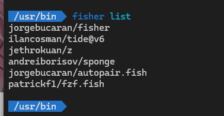

# windows 设置 fish

[在 Windows 上摸鱼（安装和使用 Fish Shell）](https://nekomoe.xyz/index.html?type=article&filename=hDa5T3wDjTRj.md)
[Ubuntu 安裝 Fish Shell + Tide 主題 與各種插件](https://www.kwchang0831.dev/dev-env/ubuntu/fish)

## 下载 Cygwin

<https://cygwin.com/install.html>

这是一个在线安装程序，安装过程会要求你选择软件源和要安装的软件包，其中软件源我选择的是 `mirrors.aliyun.com`，速度还是挺快的，然后在软件包选择界面中搜索 `fish` ，双击 `fish` 旁边的 `Skip` 字样，然后你就为 `fish` `指定了一个默认的安装版本，Skip` 字样会变成 `Fish` 的安装版本。

## 将 Fish 设定为 Cygwin 的默认 Shell

首先，编辑 `D:\software\cygwin64\etc\nsswitch.conf` ，加入或修改这一行：

```txt
db_shell: /usr/bin/fish
```

然后执行

```bash
mkpasswd > /etc/passwd
```

最后编辑 `Cygwin` 安装目录下的 `Cygwin.bat` 文件，把 `bash` 改成 `fish` 即可。

## powershell 配置 fish


## Cygwin 挂载 盘符

```bash
# 查看挂载情况
mount
```


### 临时挂载

```bash
mount C:/ /c
mount D:/ /d
```

### 永久挂载

路径：`D:\software\cygwin64\etc\fstab`

```txt
# /etc/fstab
#
#    This file is read once by the first process in a Cygwin process tree.
#    To pick up changes, restart all Cygwin processes.  For a description
#    see https://cygwin.com/cygwin-ug-net/using.html#mount-table

# This is default anyway:
# none /cygdrive cygdrive binary,posix=0,user 0 0
C:/ /c ntfs binary,posix=0,user 0 0
D:/ /d ntfs binary,posix=0,user 0 0
```

## fish 安装插件

```bash
curl -sL https://raw.githubusercontent.com/jorgebucaran/fisher/main/functions/fisher.fish | source && fisher install jorgebucaran/fisher
```



### 安裝 Tide 主題

```bash
# 安裝 Tide 主題
fisher install IlanCosman/tide@v6

# 設定 Tide 主題
tide configure
```

### 安裝插件 Z

插件 Z：類似於 autojump 的插件，比 cd 更快速地直接跳到想去的資料夾。

```bash
fisher install jethrokuan/z
```

### 安裝插件 Sponge

插件 Sponge：讓指令歷史紀錄更乾淨，不會去紀錄失敗或是打錯的指令到歷史清單中。

```bash
fisher install andreiborisov/sponge

# 清除指令歷史
history clear
```

### 安裝插件 autopair.fish

插件 autopair.fish ：自動幫你補上 () ， [] ， {} ， "" ， 還有 ''

```bash
fisher install jorgebucaran/autopair.fish
```

### 安裝 fzf.fish

fzf.fish 讓你的 Fish 互動性更強大。

- 找檔案 Ctrl + Alt + F
- 找指令歷史紀錄 Ctrl + R
- 找 PID Ctrl + Alt + P
- 直接输入fzf

更多功能查看：<https://github.com/PatrickF1/fzf.fish>

```bash
fisher install PatrickF1/fzf.fish
```

#### 安裝前置套件 fzf

```bash
scoop install fzf
```

#### 安裝前置套件 fd

```bash
scoop install fd
fd --version
```

**如果没有 `scoop` ，需要使用 `powerShell` 安装 `scoop`**

```bash
Set-ExecutionPolicy RemoteSigned -Scope CurrentUser
irm get.scoop.sh | iex
```
